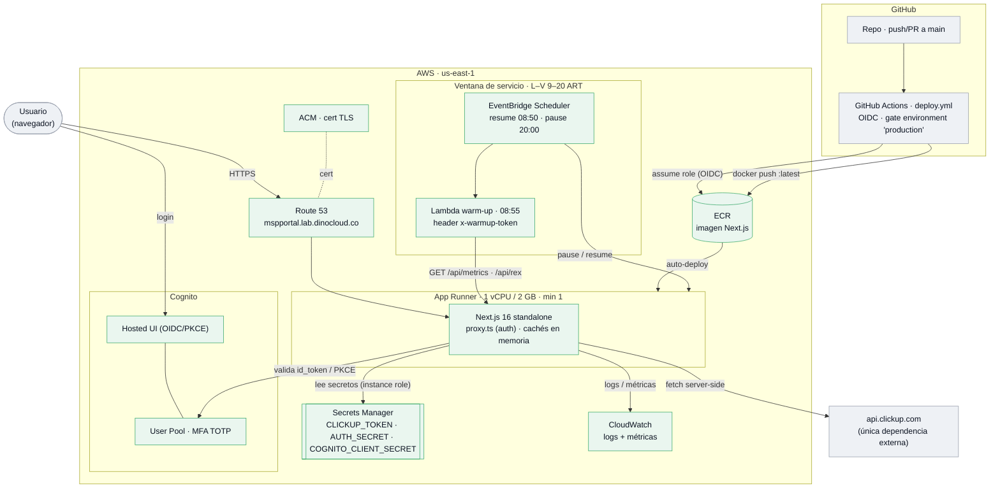

# Arquitectura — MSP Metrics Portal

> **DinoCloud Internal - Confidential**

Arquitectura **desplegada** en AWS (App Runner + Cognito + CI/CD). El diagrama es Mermaid,
se renderiza directo en GitHub. Estado operativo: ver [`../README.md`](../README.md) y
[`RUNBOOK.md`](./RUNBOOK.md).

## Puntos clave

- **Auth:** todo el tráfico pasa por `proxy.ts`; sin sesión válida redirige al Hosted UI de
  Cognito (OIDC + PKCE, MFA TOTP). Excepciones públicas: `/api/health`, `/api/auth/*` y el
  warm-up (con `x-warmup-token`).
- **Secretos:** `CLICKUP_TOKEN`, `AUTH_SECRET` y `COGNITO_CLIENT_SECRET` viven en Secrets
  Manager y se inyectan en runtime (instance role). Nunca en el repo ni en la imagen.
- **Ventana de servicio:** EventBridge Scheduler pausa (20:00) y reanuda (08:50) L–V; la
  Lambda de warm-up (08:55) precalienta las cachés (`/api/metrics` + `/api/rex`).
- **CI/CD:** GitHub Actions asume el rol vía OIDC (sin access keys), pushea a ECR y App
  Runner **auto-deploya** el `:latest`. Gate de aprobación del environment `production`.
- **Datos:** la app es *stateless*; el único dato persistente vive en ClickUp. El estado de
  Terraform (provisioning) vive en S3 + lock DynamoDB.
